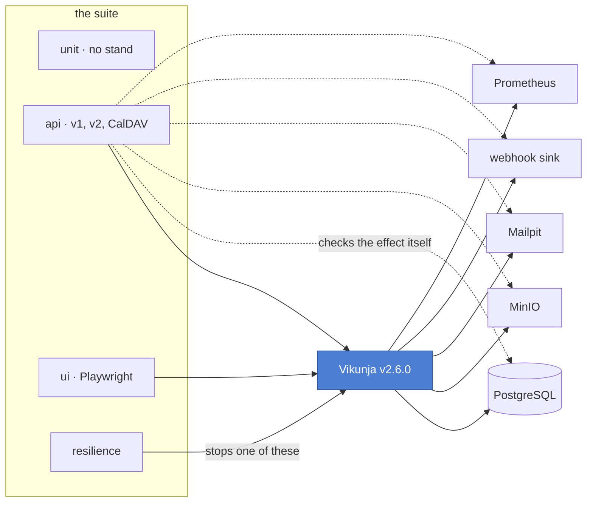

<h1 align="center">qa-framework-vikunja</h1>

<p align="center">
  <b>A reference API, browser and CalDAV test framework in Python, run against a real product.</b><br>
  Not a sandbox exercise: an eight-container stand, a thousand checks in under a minute, and seventeen real defects found.
</p>

<p align="center">
  <a href="https://github.com/petprojectsaqa/qa-framework-vikunja/actions/workflows/suite.yml"></a>
  <a href="https://petprojectsaqa.github.io/qa-framework-vikunja/"></a>
  <a href="docs/findings/"></a>
  <a href="docs/coverage-matrix.md"></a>
  
</p>

<p align="center">
  <b>English</b> · <a href="README.ru.md">Русский</a>
</p>

---

The product under test is [Vikunja](https://github.com/go-vikunja/vikunja), a self-hosted task manager, pinned at v2.6.0. It was chosen because it ships two API versions side by side and a CalDAV door onto the same data, which makes questions possible that a public sandbox cannot answer.

This is not a collection of CRUD checks. It is about the parts that usually get skipped: isolation that survives full parallelism, contract validation that costs nothing per test, an access matrix driven by data, verification through the database and the services around the product, consistency between the two API versions, and what happens when a dependency goes away.

## Start here

Five minutes, in this order:

| | |
|---|---|
| **[The live report](https://petprojectsaqa.github.io/qa-framework-vikunja/)** | every run published, with history, so trends show rather than one green tick |
| **[What was found](docs/findings/)** | sixteen defects, each reproducible in two minutes by a script that imports nothing from this framework |
| **[Why it is built this way](docs/strategy.md)** | every decision with the alternative it was chosen over |
| **[What is covered](docs/coverage-matrix.md)** | the matrix each test is bound to, and the count behind every row |

The one file that shows the design: [`src/vikunja_qa/testing/plugin.py`](src/vikunja_qa/testing/plugin.py), the plugin that makes the suite's conventions hold instead of hoping they do.

## The stack

**Testing**
<p>
  
  
  
  
  
  
  
  
</p>

**The stand**
<p>
  
  
  
  
  
  
  
  
</p>

**Quality gates**
<p>
  
  
  
  
  
</p>

## How it fits together



Every response the suite receives, from any test, is validated against the schema for its operation on the way past. That is why contract coverage reaches 99% of both API versions without a single contract test being written.

## How it was built

**AI-first engineering.** This framework was built the way I work: with AI in the loop. AI speeds up implementation and widens the search for defects, while the architecture, the test strategy and every trade-off are engineering decisions, each written down in [docs/strategy.md](docs/strategy.md) with the alternatives it was chosen over. That combination is what lets one engineer deliver this depth of coverage: most of the suite is generated from the product's own API descriptions, and it has already found seventeen real defects.

## Status

| | |
|---|---|
| Main run | 1200 passing, 16 skipped, 5 expected failures |
| Generated from the product's own descriptions | 791 of 940 matrix-bound tests |
| Run time on eight workers | about 50 seconds |
| API operations exercised | 99% of both versions |
| The framework's own tests, no stand needed | 280 in 22 seconds |
| Resilience layer, run on its own | 6 |
| Defects found in the product | 17 |

Every row of the [coverage matrix](docs/coverage-matrix.md) has tests behind it, and the run prints the table at the end so a gap cannot open quietly. Three things end a run red beyond a failing test: a response that deviates from its contract in a way the baseline does not already account for, a matrix check of the required priority that ran nothing at all, and a module that breaks the suite's conventions.

## Quick start

You need Docker with Compose, and [uv](https://docs.astral.sh/uv/).

```bash
uv sync --extra dev
```

```bash
docker compose -f docker/docker-compose.yml up -d --quiet-pull
```

```bash
uv run python scripts/check_stand.py
```

```bash
uv run pytest -n 8
```

The readiness check is not optional: `docker compose up` returns before the product answers. The script waits for every service, locates both API descriptions and walks one real user path end to end, so a green result means the stand is actually usable.

Browser tests need a browser, installed once:

```bash
uv run playwright install chromium
```

The critical path across both layers, in about ten seconds:

```bash
uv run pytest -m smoke tests/api tests/ui
```

Any row of the coverage matrix can be run on its own. Each check code is a marker:

```bash
uv run pytest -m acl
```

The resilience layer stops containers, so it is left out unless asked for, and it refuses to run in parallel:

```bash
uv run pytest tests/resilience --resilience
```

## Design notes

**Isolation comes from ownership, not cleanup.** Everything in Vikunja belongs to a user, so each test works under freshly registered accounts, and accounts that have never met cannot see each other's data. That gives full parallelism with no truncation between tests. The product ships a test API that empties every table, and it is deliberately not used for this.

**Registration walks the real path.** The stand runs with mail enabled, so the product holds a new account until its address is confirmed. The suite reads the message from the mail trap, takes the token and spends it. The round trip costs about 0.4 seconds, so there is no reason to flip the account status in the database, and the mail pipeline stays under continuous test.

**Contract validation is a side effect.** Responses are checked against their schema in the transport layer, so every call made by every test is validated and no separate contract suite is needed. Both descriptions are fetched from the running instance rather than from the product's repository. On its first day the check found four defects in a sample of 32 calls.

**Strict mode, with known deviations in a baseline.** A deviation missing from the baseline fails the test that produced it. The baseline holds only findings already written up; each entry names its report and gives a reason. It may only shrink, and the end of a run prints the entries nothing hit, which is how one was found to be describing a defect the product no longer has.

**Check lists come from the product, not from a hand-kept file.** The authorization sweep is generated from both API descriptions, and the token scope matrix from the permission catalogue the product publishes itself. An endpoint added tomorrow is covered on the next run, and no list can drift from reality.

**Conventions are enforced, not documented.** Directories carry meaning: the top level is the execution layer, the second is the capability under test. Every product test declares the matrix checks it provides, and from that declaration the suite derives its selection marker, its severity, and the links in the report back to the matrix row and to any finding it pins. A test that declares nothing, or names a check or a finding that does not exist, is refused at collection.

**A silently skipped family fails the build.** `--fail-uncovered P0` turns a matrix check with no tests red. That is not hypothetical: an entire generated family had been skipping itself at collection for weeks, in every run that wrote a report, and nothing noticed until the run started printing the matrix.

**State is declared, not programmed.** A test describes the world it needs in one chain and a builder makes the calls. Link shares and team members become actors like anyone else, so a row of the access matrix does not care how its caller got in.

**What happens outside the response is checked too.** Mail is read from the trap, outgoing webhooks from a dedicated sink, files through object storage, counters from the metrics scrape, and data integrity through direct PostgreSQL queries. That is why the stand runs eight containers.

**There is not a single fixed pause.** Waiting polls a condition against an explicit deadline, and a timeout says what it was waiting for. The two exceptions are named in the tests that hold them, and a unit test fails the build on any other.

**The browser never signs in through the form.** The account is prepared over the API and its token placed in browser storage before the application boots, so a page opens directly where the test needs it. A test fails only when the thing it checks is broken.

**API tests never retry.** A flaky API test is either a defect in the test or a real race in the product, and both need investigating. Browser tests get one retry, used to capture a trace rather than to turn a run green.

**Open questions are not presented as settled.** Where the product's behaviour looks like a defect that cannot be proven, the test is marked as an expected failure. It states the position without breaking the build, and turns into an unexpected pass if the product changes.

The full reasoning, with the alternatives each decision was chosen over, is in [docs/strategy.md](docs/strategy.md); scope and priorities are in [docs/coverage-matrix.md](docs/coverage-matrix.md). Both are available in English and Russian.

## Layout

```
docker/     the eight-service stand and the webhook sink
docs/       coverage matrix, strategy, findings
scripts/    stand readiness check and the findings runner
src/        the framework
tests/      unit, api, ui, resilience
```

The suite is laid out by what a test needs to run, then by what it covers:

```
tests/unit/            the framework testing itself; runs with the stand off
tests/api/<area>/      framework, authorization, boundaries, contracts,
                       rules, integrity, side_effects, calendar,
                       concurrency, regressions
tests/ui/<area>/       framework, tasks, views, permissions, localisation
tests/resilience/      dependency outages, on its own run
```

Layers inside `src` depend in one direction only, and a unit test parses the source to prove it: no assertion below the test layer, no HTTP in a test, and nothing but the pytest-facing package knows pytest exists.

## Findings

Sixteen defects, each in its own folder with a write-up in both languages and a reproduction. Two of them are held back from publication until the product's maintainers have answered, so fourteen are here:

```bash
python scripts/verify_findings.py
```

On Windows PowerShell, use `py` in place of `python`.

The scripts import nothing from the framework and need no dependencies, so a reviewer can confirm a finding without reading the code. Each prints what the product's description promises beside what the product does, and exits zero when the finding still reproduces.

## Report

The report of the latest run is published automatically at [petprojectsaqa.github.io/qa-framework-vikunja](https://petprojectsaqa.github.io/qa-framework-vikunja/). History is kept between runs, so trends are visible rather than only the last result.

Every test in it carries the matrix check it covers, a severity derived from that check's priority, and links back to the matrix row and to any finding it pins.
