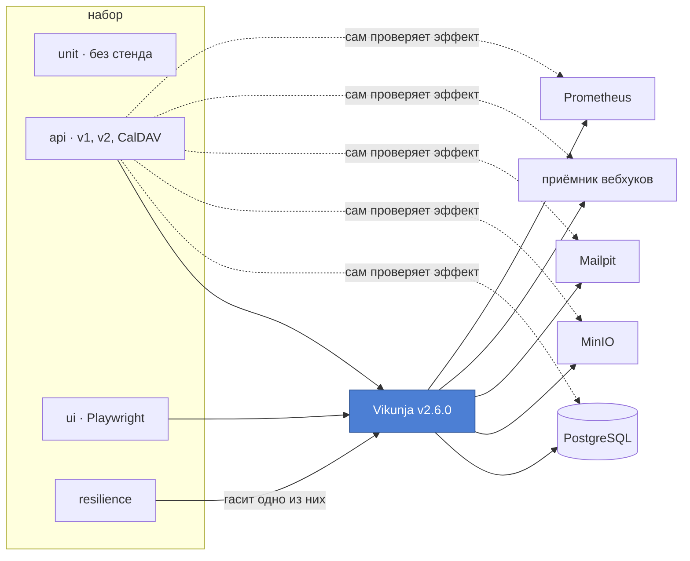

<h1 align="center">qa-framework-vikunja</h1>

<p align="center">
  <b>Эталонный фреймворк тестирования API, браузера и CalDAV на Python, работающий против настоящего продукта.</b><br>
  Не упражнение в песочнице: стенд из восьми контейнеров, тысяча проверок меньше чем за минуту и шестнадцать настоящих дефектов.
</p>

<p align="center">
  <a href="https://github.com/petprojectsaqa/qa-framework-vikunja/actions/workflows/suite.yml"></a>
  <a href="https://petprojectsaqa.github.io/qa-framework-vikunja/"></a>
  <a href="docs/findings/"></a>
  <a href="docs/coverage-matrix.ru.md"></a>
  
</p>

<p align="center">
  <a href="README.md">English</a> · <b>Русский</b>
</p>

---

Объект тестирования — [Vikunja](https://github.com/go-vikunja/vikunja), самостоятельно размещаемый менеджер задач, зафиксированный на версии 2.6.0. Он выбран потому, что держит рядом две версии API и дверь CalDAV к тем же данным, а это позволяет задавать вопросы, на которые публичная песочница ответить не может.

Это не набор CRUD-проверок. Здесь то, что обычно пропускают: изоляция, выдерживающая полную параллельность, контрактная проверка, ничего не стоящая каждому тесту, матрица доступа на данных, проверка через базу и через сервисы вокруг продукта, согласованность двух версий API и поведение при отказе зависимости.

## С чего начать

Пять минут, в таком порядке:

| | |
|---|---|
| **[Живой отчёт](https://petprojectsaqa.github.io/qa-framework-vikunja/)** | каждый прогон публикуется, с историей, поэтому видны тенденции, а не одна зелёная галочка |
| **[Что найдено](docs/findings/)** | шестнадцать дефектов, каждый воспроизводится за две минуты скриптом, который ничего не импортирует из фреймворка |
| **[Почему устроено так](docs/strategy.ru.md)** | каждое решение вместе с альтернативой, от которой отказались в его пользу |
| **[Что покрыто](docs/coverage-matrix.ru.md)** | матрица, к которой привязан каждый тест, и число за каждой строкой |

Один файл, по которому видно устройство: [`src/vikunja_qa/testing/plugin.py`](src/vikunja_qa/testing/plugin.py), плагин, благодаря которому соглашения набора выполняются, а не остаются пожеланием.

## Стек

**Тестирование**
<p>
  
  
  
  
  
  
  
  
</p>

**Стенд**
<p>
  
  
  
  
  
  
  
  
</p>

**Ворота качества**
<p>
  
  
  
  
  
</p>

## Как это устроено



Каждый ответ, который набор получает в любом тесте, по дороге проверяется против схемы своей операции. Именно поэтому контрактное покрытие доходит до 99% обеих версий API, и при этом не написано ни одного контрактного теста.

## Как это сделано

**AI-first инженерия.** Фреймворк построен так, как я работаю: с ИИ в контуре. ИИ ускоряет реализацию и расширяет поиск дефектов, а архитектура, стратегия тестирования и каждый компромисс остаются инженерными решениями, и каждое записано в [docs/strategy.ru.md](docs/strategy.ru.md) вместе с альтернативами, от которых я отказался в его пользу. Именно это сочетание позволяет одному инженеру дать такую глубину покрытия: большая часть набора порождается из описаний API самого продукта, и он уже нашёл шестнадцать настоящих дефектов.

## Статус

| | |
|---|---|
| Основной прогон | 1126 пройдено, 16 пропущено, 5 ожидаемых падений |
| Порождено из описаний самого продукта | 790 из 929 тестов, привязанных к матрице |
| Время прогона на восьми исполнителях | около 40 секунд |
| Задействовано операций API | 99% обеих версий |
| Собственные тесты фреймворка, стенд не нужен | 190 за 13 секунд |
| Слой устойчивости, отдельным прогоном | 6 |
| Найдено дефектов продукта | 16 |

За каждой строкой [матрицы покрытия](docs/coverage-matrix.ru.md) стоят тесты, и прогон печатает таблицу в конце, поэтому пробел не может открыться незаметно. Тонкие — это коды ошибок и некорректный ввод, где задумано семейство, а не та горстка, что написана пока.

## Быстрый старт

Понадобятся Docker с Compose и [uv](https://docs.astral.sh/uv/).

```bash
uv sync --extra dev
```

```bash
docker compose -f docker/docker-compose.yml up -d --quiet-pull
```

```bash
uv run python scripts/check_stand.py
```

```bash
uv run pytest -n 8
```

Проверка готовности обязательна: `docker compose up` возвращает управление раньше, чем продукт начинает отвечать. Скрипт дожидается каждого сервиса, находит оба описания API и проходит один настоящий пользовательский путь целиком, поэтому зелёный результат означает, что стендом действительно можно пользоваться.

Браузерным тестам нужен браузер, ставится один раз:

```bash
uv run playwright install chromium
```

Критический путь по обоим слоям, около десяти секунд:

```bash
uv run pytest -m smoke tests/api tests/ui
```

Любую строку матрицы покрытия можно прогнать отдельно. Код каждой проверки это маркер:

```bash
uv run pytest -m acl
```

Слой устойчивости гасит контейнеры, поэтому без явной просьбы не запускается и отказывается идти параллельно:

```bash
uv run pytest tests/resilience --resilience
```

## Решения

**Изоляция строится на владельце, а не на уборке.** В Vikunja всё принадлежит пользователю, поэтому каждый тест работает под свежезарегистрированными аккаунтами, а аккаунты, которые никогда не встречались, не видят данных друг друга. Отсюда полная параллельность без очистки базы между тестами. Продукт предоставляет служебный API, опустошающий все таблицы, и он сознательно для этого не используется.

**Регистрация идёт настоящим путём.** Стенд работает с включённой почтой, поэтому продукт держит новый аккаунт до подтверждения адреса. Набор читает письмо из перехватчика, забирает токен и тратит его. Полный круг занимает около 0,4 секунды, так что подменять статус аккаунта в базе незачем, а почтовый тракт остаётся под непрерывной проверкой.

**Контрактная проверка это побочный эффект.** Ответы сверяются со схемой в транспортном слое, значит каждый вызов каждого теста проверяется и отдельный контрактный набор не нужен. Оба описания забираются с работающего инстанса, а не из репозитория продукта. В первый же день проверка нашла четыре дефекта на выборке из 32 вызовов.

**Режим строгий, известные расхождения вынесены в базовую линию.** Расхождение, которого нет в базовой линии, роняет тест, который его вызвал. В базовой линии только уже описанные находки: каждая запись называет свой отчёт и объясняет причину. Она может только сокращаться, а в конце прогона печатаются записи, в которые ничего не попало, — так и выяснилось, что одна из них описывала дефект, которого в продукте больше нет.

**Списки проверок берутся у продукта, а не из файла, который ведут руками.** Обход авторизации порождается из обоих описаний API, а матрица областей действия токена из каталога прав, который продукт публикует сам. Эндпоинт, добавленный завтра, попадёт под проверку на следующем прогоне, и ни один список не может разъехаться с реальностью.

**Соглашения не описаны, а принудительны.** Каталоги несут смысл: верхний уровень это слой исполнения, второй — проверяемая возможность. Каждый тест продукта объявляет проверки матрицы, которые он закрывает, и из этого объявления набор выводит маркер для отбора, серьёзность и ссылки в отчёте на строку матрицы и на находку, которую тест фиксирует. Тест, который не объявил ничего или назвал несуществующую проверку или находку, отклоняется на сборе.

**Молча пропущенное семейство роняет сборку.** `--fail-uncovered P0` красит проверку матрицы без тестов в красный. Это не умозрительный случай: целое порождённое семейство неделями пропускало само себя на сборе, в каждом прогоне, который писал отчёт, и никто этого не замечал, пока прогон не начал печатать матрицу.

**Состояние объявляется, а не программируется.** Тест описывает нужный мир одной цепочкой, строитель выполняет вызовы. Публичные ссылки и участники команд становятся такими же действующими лицами, как все, поэтому строка матрицы доступа не знает, каким путём её вызывающий попал внутрь.

**Проверяется и то, что происходит вне ответа.** Письмо читается из перехватчика, исходящий вебхук из собственного приёмника, файл через объектное хранилище, счётчик из системы метрик, а целостность данных прямыми запросами к PostgreSQL. Ради этого стенд и держит восемь контейнеров.

**Фиксированных пауз нет ни одной.** Ожидание опрашивает условие с явным сроком, и по истечении срока сообщение говорит, чего именно оно ждало. Два исключения названы в тех тестах, которые их держат, и модульный тест роняет сборку на любом другом.

**Браузер не входит через форму.** Аккаунт готовится по API, токен кладётся в браузерное хранилище до запуска приложения, и страница открывается сразу там, где она нужна тесту. Тест падает, только когда сломано то, что он проверяет.

**У тестов API нет повторов.** Мигающий тест API это либо дефект теста, либо настоящая гонка в продукте, и оба случая требуют разбора. Браузерным разрешён один повтор, и то как средство записать трассировку, а не способ получить зелёный прогон.

**Спорное не выдаётся за решённое.** Там, где поведение продукта похоже на дефект, но доказать это нельзя, тест помечается как ожидаемо падающий. Он формулирует позицию, не ломает сборку и превратится в неожиданный успех, если продукт изменит поведение.

Полные рассуждения и альтернативы, от которых отказались в пользу каждого решения, в [docs/strategy.ru.md](docs/strategy.ru.md); объём и приоритеты покрытия в [docs/coverage-matrix.ru.md](docs/coverage-matrix.ru.md). Оба документа есть на английском и на русском.

## Структура

```
docker/     стенд из восьми сервисов и приёмник вебхуков
docs/       матрица покрытия, стратегия, находки
scripts/    проверка готовности стенда и запуск воспроизведений
src/        фреймворк
tests/      unit, api, ui, resilience
```

Набор разложен по тому, что тесту нужно для запуска, и затем по тому, что он проверяет:

```
tests/unit/            the framework testing itself; runs with the stand off
tests/api/<area>/      framework, authorization, boundaries, contracts,
                       rules, integrity, side_effects, calendar,
                       concurrency, regressions
tests/ui/<area>/       framework, tasks, views, permissions, localisation
tests/resilience/      dependency outages, on its own run
```

Слои внутри `src` зависят строго в одну сторону, и модульный тест разбирает исходники, чтобы это доказать: ни одного утверждения ниже слоя тестов, ни одного HTTP-вызова в тесте, и о существовании pytest знает только пакет, обращённый к pytest.

## Находки

Шестнадцать дефектов, каждый в своей папке с описанием на двух языках и воспроизведением. Два из них придержаны от публикации до ответа сопровождающих продукта, поэтому здесь лежат четырнадцать:

```bash
python scripts/verify_findings.py
```

В PowerShell на Windows вместо `python` используйте `py`.

Скрипты ничего не импортируют из фреймворка и не требуют зависимостей, поэтому проверяющий может убедиться в находке, не читая код. Каждый печатает рядом то, что обещает описание продукта, и то, что продукт делает, и завершается нулём, пока находка воспроизводится.

## Отчёт

Отчёт последнего прогона публикуется автоматически: [petprojectsaqa.github.io/qa-framework-vikunja](https://petprojectsaqa.github.io/qa-framework-vikunja/). История сохраняется между прогонами, поэтому видны тренды, а не только последний результат.

Каждый тест в нём несёт проверку матрицы, которую он закрывает, серьёзность, выведенную из приоритета этой проверки, и ссылки на строку матрицы и на находку, которую он фиксирует.
